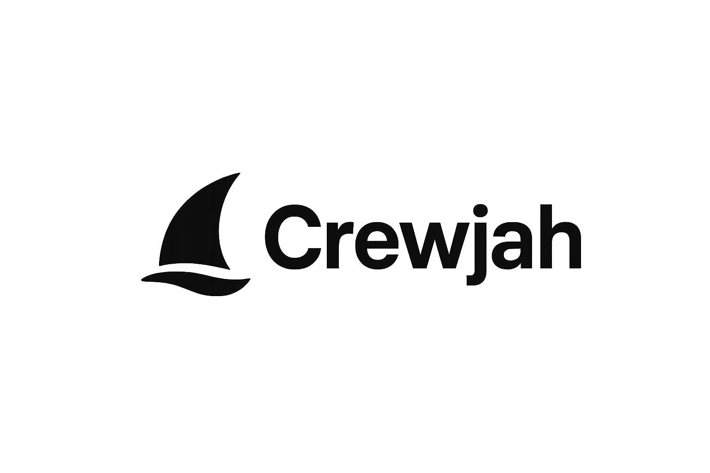

<div align="center">
	
	<h1>Crewjah</h1>
	<p><b>Open Source Modern Educational Platform</b></p>
</div>


Crewjah is a professional, open-source educational platform built with React, Vite, and TailwindCSS. It provides learners with AI-powered study tools for note summarization, Q&A, study planning, and progress tracking. The project is fully open source and welcomes community contributions.

## Features
- Modern, responsive UI built with TailwindCSS
- AI-powered study assistant
- Summarize notes, ask questions, plan study, track progress
- Beautiful landing page, dashboard, and educational tools
- Open source and community-driven

## Project Log
- Initial scaffold with React + Vite
- Added routing and multiple educational pages
- Fixed all JSX/JS errors, improved imports/exports
- Upgraded UI to a modern, branded design with TailwindCSS
- Implemented animated hero, buttons, and responsive layout
- Added open source documentation and contribution guidelines

## Open Source
Crewjah is fully open source under the MIT License. You are free to use, modify, and distribute this project for personal, educational, or commercial purposes. All development, issues, and discussions are public. Contributions are welcome!

## Getting Started
1. Clone the repository:
	```bash
	git clone https://github.com/Crewjah/Crewjah.git
	cd Crewjah/client
	```
2. Install dependencies:
	```bash
	npm install
	```
3. Run the development server:
	```bash
	npm run dev
	```
4. Open in browser:
	Visit `http://localhost:5173` (or the port shown in your terminal)

## Contributing
We welcome contributions from everyone! To contribute:
- Fork the repository
- Create a new branch for your feature or fix
- Submit a pull request with a clear description
- All contributions must follow the MIT license and code of conduct

## Tech Stack
- React
- Vite
- TailwindCSS

## License
This project is licensed under the MIT License. See [LICENSE](client/LICENSE) for details.

---

Made with passion and open source spirit. <span style="font-size:1.5em;">❤️</span>

## 💬 Community
- Issues: Use the GitHub Issues tab
- Discussions: Join our GitHub Discussions
- Logo: 
---
Made with ❤️ by the Crewjah open source community.
